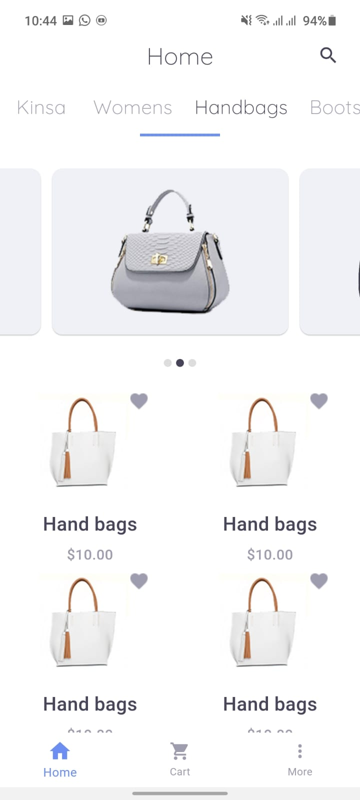

# Momma Fashion

**Momma Fashion** is a cross-platform e-commerce mobile app built using **Flutter**.  
The app allows users to browse and purchase fashion products with a clean and responsive user interface.  

---

## Features

- Browse products by category and search/filter products
- User authentication (Sign up / Login)
- Shopping cart and checkout functionality
- Real-time backend integration using Firebase
- Responsive UI with modern animations
- Supports both Android and iOS

---

## Screenshots

### Home Screen


### Product List


### Cart


### Checkout


---

## Tech Stack

- **Flutter** for cross-platform mobile development
- **Dart** as programming language
- **Firebase** for backend, authentication, and real-time database
- **Provider** for state management
- **Material Design** for UI components

---

## Getting Started

To run this project locally:

1. Make sure you have **Flutter** installed. [Flutter installation guide](https://docs.flutter.dev/get-started/install)
2. Clone the repository:
   ```bash
   git clone https://github.com/SamerZaina/Momma_Fashion.git
